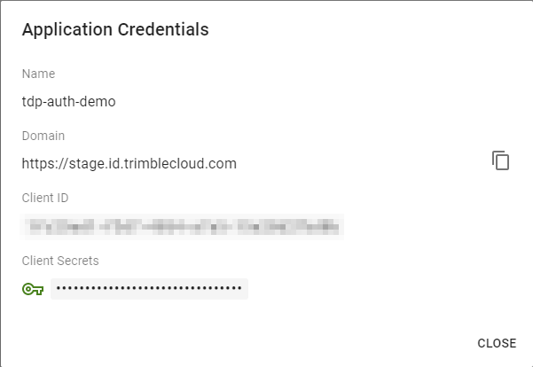

# Getting Started with Trimble Identity and React

> 👍 with bonus [Modus](https://modus-bootstrap.trimble.com/getting-started/) styles

## Setup

### 🚀 Create React app

Create new react application with create-react-app

```bash
npx create-react-app@latest tdp-react-auth-example --template typescript
```

Start the development server

```bash
npm start
```

### 🔒 Add authentication libraries

This demo uses the [oidc typescript client](https://www.npmjs.com/package/oidc-client-ts) and [React oidc context extension](https://www.npmjs.com/package/react-oidc-context) for Trimble Identity authentication. These libraries greatly simplify the process.

```bash
npm install oidc-client-ts react-oidc-context
```

### 🌈 Add Modus styles

Add Modus styles. We are using a basic setup for Modus to keep things simple.

```bash
npm install --save-dev @trimbleinc/modus-bootstrap
```

Replace the base styles in index.css with Modus

```css
/* src/index.css */
@import "../node_modules/@trimbleinc/modus-bootstrap/dist/modus.min.css";

/* delete default styles */
/*
body {
  margin: 0;
  font-family: -apple-system, BlinkMacSystemFont, 'Segoe UI', 'Roboto', 'Oxygen',
    'Ubuntu', 'Cantarell', 'Fira Sans', 'Droid Sans', 'Helvetica Neue',
    sans-serif;
  -webkit-font-smoothing: antialiased;
  -moz-osx-font-smoothing: grayscale;
}
code {
  font-family: source-code-pro, Menlo, Monaco, Consolas, 'Courier New',
    monospace;
} 
*/
```

##  Trimble Console Setup

Log into the [Trimble Cloud Console](https://console.trimble.com/home)

### ➕ Create Trimble Console Application

Navigate to the Applications list and select:


Provide the following information at the prompts:

| **_Application_** |             |
| ----------------- | :---------- |
| Application Type  | Application |

| **_Details_**           |                         |
| ----------------------- | :---------------------- |
| Application Environment | Pre Prod                |
| Name                    | _your application name_ |
| Display Name            | _your display name_     |
| Description             | _your description_      |

| **_Configuration_**      |                       |
| ------------------------ | :-------------------- |
| Authorization Code Grant | ✅                    |
| Client Credentials       | ⬛                    |
| Use Refresh Tokens       | ✅                    |
| Token Exchange           | ⬛                    |
| Allowed Callback URLs    | http://localhost:3000 |
| Allowed Logout URLs      | http://localhost:3000 |

### 📝 Note the application credentials

In the application list select the **View Credentials** button and capture the following fields for your new application:

- Name
- Domain
- Client Id



## Configure Application Authentication

Implementing the authentication provider and context is straight forward. Configure the `AuthProvider` and wrap the root `<App />` component then access the authentication context with the `useAuth()` hook in any children.

### 👮‍♂️ Configure the AuthProvider

The `AuthProvider` wraps the React `<App />` object to provide an authentication context to all child components.

In the `index.tsx` file we:

- Import the `AuthProvider`
- Configure `AuthProviderProps`
- Wrap the `<App />` component

```tsx
// src/index.tsx
...
import { AuthProvider, AuthProviderProps } from "react-oidc-context";

const authProps: AuthProviderProps = {
  authority: "<Domain>",
  client_id: "<Client Id>",
  redirect_uri: "http://localhost:3000",
  scope: "openid <Name>",
}

const root = ReactDOM.createRoot(
  document.getElementById('root') as HTMLElement
);
root.render(
  <React.StrictMode>
    <AuthProvider {...authProps}>
      <App />
    </AuthProvider>
  </React.StrictMode>
);
```

### 🔑 Implement Login / Logout

We are now ready to implement _sign in_ and _sign out_ in the main `<App />` component.

First, import useAuth hook from the react-oidc-context library to access the authentication state and methods. Next we implement the the UI with a nested ternary 😱 and separate components for each of the 3 possibly states.

```tsx
// src/app.tsx
import { useAuth } from "react-oidc-context";

export default function App() {
  const auth = useAuth();

  return (
    <div className="App">
      {auth.isLoading ? (
        <Loading />
      ) : auth.isAuthenticated ? (
        <Home />
      ) : (
        <Login />
      )}
    </div>
  );
}
```

Each of the above components in implemented is follows:

`<Loading />`

```tsx
// src/app.tsx
function Loading() {
  return (
    <div className="card border-dark shadow">
      <div className="card-body">
        <div className="text-center text-primary">
          <div className="spinner-border"></div>
          <div className="h1 text-primary mt-3">Loading...</div>
        </div>
      </div>
    </div>
  );
}
```

`<Home />`

```tsx
// src/app.tsx
function Home() {
  const auth = useAuth();

  const signOut = () => {
    auth.signoutRedirect();
  };

  const epochToLocal = (epoch: number) => {
    const d = new Date(epoch * 1000);
    return d.toLocaleString();
  };

  return (
    <>
      <div className="card border-dark shadow mb-2">
        <div className="card-body">
          <h4 className="card-title" id="card-title">
            Trimble Identity Demo
          </h4>
          <h5 className="card-subtitle mb-2 text-muted" id="card-subtitle">
            Welcome
          </h5>
          

          <p className="card-text">
            {auth.user?.profile?.given_name} {auth.user?.profile?.family_name}
          </p>
          <p className="card-text">
            {auth.user?.profile?.email}{" "}
            {auth.user?.profile.email_verified ? "(Verified)" : ""}
          </p>
          <p className="card-text">
            Token Expires:{" "}
            {auth.user?.expires_at ? epochToLocal(auth.user?.expires_at) : ""}
          </p>
          <button className="btn btn-primary" onClick={signOut}>
            Sign Out
          </button>
        </div>
      </div>
    </>
  );
}
```

`<Login />`

```tsx
// src/app.tsx
function Login() {
  const auth = useAuth();

  const signIn = () => {
    console.log("Login");
    auth.signinRedirect();
  };

  return (
    <div className="card border-dark shadow">
      <div className="card-body">
        <h4 className="card-title" id="card-title">
          Trimble Identity Demo
        </h4>
        <h5 className="card-subtitle mb-2 text-muted" id="card-subtitle">
          Sign In
        </h5>
        <p className="card-text">
          Click the sign in button to login using Trimble Identity
        </p>
        <button className="btn btn-primary" onClick={signIn}>
          Sign In
        </button>
      </div>
    </div>
  );
}
```
